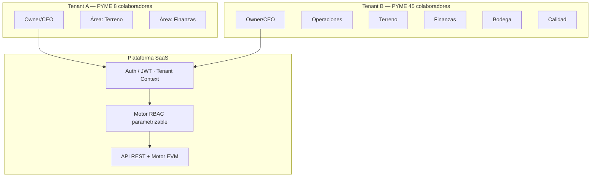
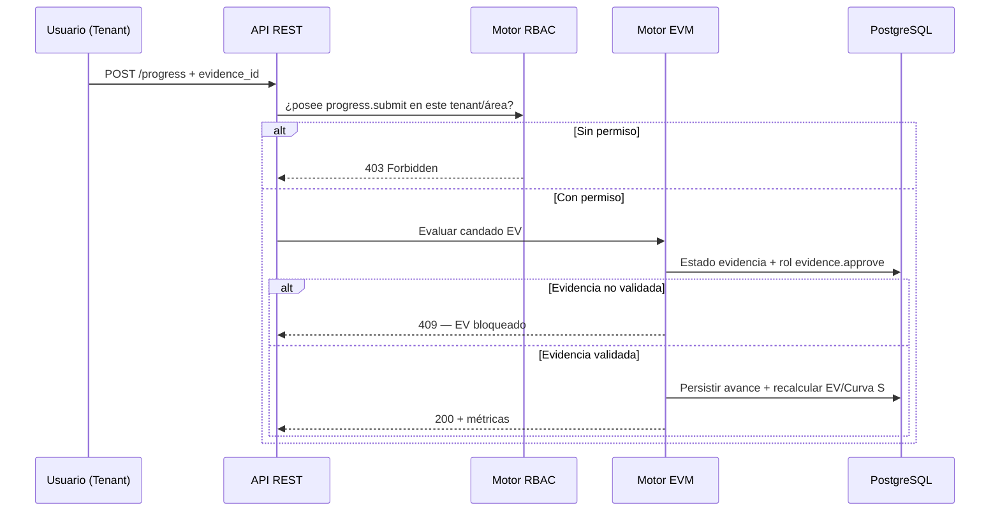
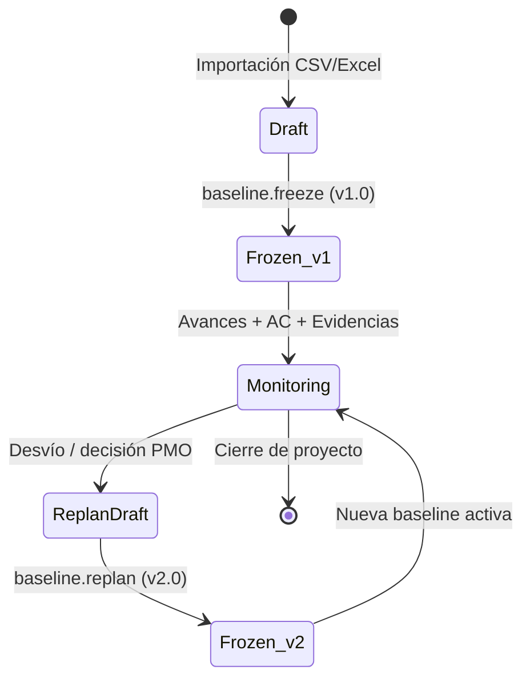
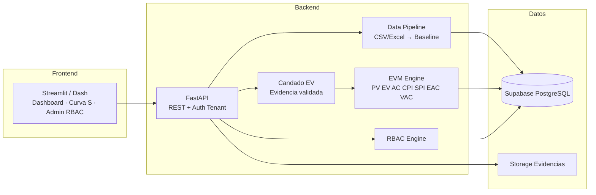
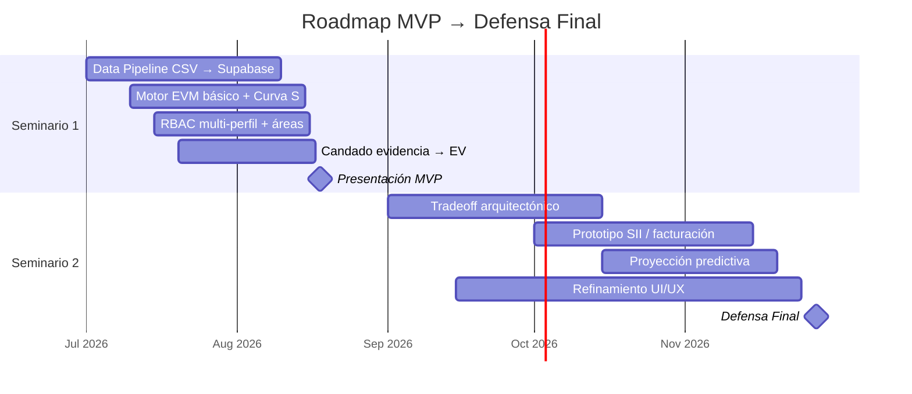

# Plataforma SaaS de Control de Proyectos EVM y Curva S Adaptable para PYMEs en Chile

[](./docs)
[](./docs)
[](#4-stack-tecnológico-mvp-fase-1)
[](#2-arquitectura-rbac-adaptable--multi-tenancy)
[](#1-resumen-técnico--diferenciador)
[](#8-equipo-gobernanza-y-licencia)

> **Proyecto de Tesis de Grado** — Plataforma **SaaS** accesible para el control de proyectos en PYMEs chilenas, con motor de **Earned Value Management (EVM)**, visualización de **Curva S**, **RBAC multi-tenant adaptable** y **candado metodológico**: bloqueo del Valor Ganado ($EV$) sin evidencia documental validada en terreno.

| Hito | Fecha | Entregable principal |
|------|-------|----------------------|
| **Seminario 1** — Presentación MVP | **18 de agosto de 2026** | Data Pipeline CSV→Supabase, Motor EVM, RBAC, bloqueo $EV$, Curva S |
| **Seminario 2** — Defensa Final | **Noviembre de 2026** | Tradeoff arquitectónico, integración financiera/SII, proyección predictiva, UI/UX |

---

## Tabla de Contenidos

1. [Resumen Técnico & Diferenciador](#1-resumen-técnico--diferenciador)
2. [Arquitectura RBAC Adaptable & Multi-Tenancy](#2-arquitectura-rbac-adaptable--multi-tenancy)
3. [Flujo de Importación y Ciclo de Vida del Dato](#3-flujo-de-importación-y-ciclo-de-vida-del-dato)
4. [Stack Tecnológico MVP (Fase 1)](#4-stack-tecnológico-mvp-fase-1)
5. [Arquitectura de Componentes y Flujo de Datos](#5-arquitectura-de-componentes-y-flujo-de-datos)
6. [Roadmap de Desarrollo (Seminario 1 → Seminario 2)](#6-roadmap-de-desarrollo-seminario-1--seminario-2)
7. [Estructura del Repositorio Git](#7-estructura-del-repositorio-git)
8. [Equipo, Gobernanza y Licencia](#8-equipo-gobernanza-y-licencia)
9. [Quickstart (Configuración Local)](#9-quickstart-configuración-local)

---

## 1. Resumen Técnico & Diferenciador

### 1.1 Problema: barrera de costo y complejidad para la PYME chilena

Herramientas enterprise como **Oracle Primavera P6** o **Microsoft Project** concentran capacidades de planificación avanzada (nivelación de recursos, multiproyecto, calendarios complejos), pero imponen:

| Dimensión | Herramientas enterprise | Realidad PYME (Chile) |
|-----------|-------------------------|------------------------|
| **Costo de licencia** | CAPEX/OPEX elevado | Presupuesto limitado; sensibilidad al TCO |
| **Curva de aprendizaje** | Requiere planificadores especializados | Equipos de 5–50+ colaboradores, roles multifuncionales |
| **Complejidad funcional** | Over-engineering para control básico–intermedio | Necesidad de avance, costo y Curva S accionable |
| **Gobernanza del avance** | Declarativo o débilmente auditado | Riesgo de **inflación de avances** en terreno |
| **Adaptabilidad organizacional** | Perfiles rígidos o costosos de personalizar | PYMEs heterogéneas (Operaciones, Terreno, Finanzas, Bodega) |

El resultado frecuente es la subutilización del software enterprise o el retorno a planillas ad hoc (Excel), con pérdida de trazabilidad y de confiabilidad en indicadores de desempeño.

### 1.2 Propuesta de valor SaaS

Plataforma **multi-tenant** de bajo costo operativo que:

1. Importa y **congela** la Línea Base ($PV$, fechas) desde CSV/Excel.
2. Calcula automáticamente métricas EVM: **$PV$, $EV$, $AC$, $CPI$, $SPI$, $EAC$, $VAC$** y **Curva S**.
3. Aplica un **candado metodológico** sobre el Valor Ganado.
4. Adapta **áreas y permisos (RBAC)** al tamaño y estructura de cada PYME, parametrizados por el perfil **Owner/CEO**.

### 1.3 Candado metodológico: bloqueo de $EV$ sin evidencia validada

> **Regla de negocio crítica:** el Valor Ganado ($EV$) **no se contabiliza** si el avance reportado en terreno carece de **evidencia documental en estado validado**.

```text
EV := f(% avance, presupuesto de actividad)
     iff evidencia.estado = "validada"
     else EV permanece sin incremento (bloqueo)
```

| Estado de evidencia | Efecto sobre $EV$ | Efecto operativo |
|---------------------|-------------------|------------------|
| Ausente / pendiente | **Bloqueo** — $EV$ no se actualiza | Avance visible como “declarado”, no ganado |
| Rechazada | **Bloqueo** | Requiere nueva evidencia |
| Validada (rol autorizado) | **Desbloqueo** — $EV$ se recalcula | Curva S y $CPI$/$SPI$ reflejan avance ganado |

Este mecanismo mitiga la **inflación artificial de avances** y alinea el control de proyectos con la trazabilidad documental exigida en obra.

---

## 2. Arquitectura RBAC Adaptable & Multi-Tenancy

### 2.1 Modelo multi-tenant

Cada organización (tenant) es una unidad de aislamiento lógico en Supabase/PostgreSQL:

| Concepto | Descripción |
|----------|-------------|
| **Tenant (Organización)** | PYME cliente; datos de proyectos, usuarios y áreas aislados |
| **Owner / CEO** | Perfil administrativo del tenant; parametriza áreas y matriz de permisos |
| **Áreas** | Unidades organizacionales configurables (no hardcodeadas) |
| **Roles** | Conjuntos de permisos asignables a usuarios dentro del tenant |
| **Escalabilidad organizacional** | Desde **~5** hasta **50+** colaboradores, sin redeploy |



### 2.2 Áreas parametrizables por Owner/CEO

El Owner/CEO define el catálogo de áreas según el tamaño y el modelo operativo de la PYME. Catálogo de referencia (extensible):

| Área | Función típica en el ciclo EVM |
|------|--------------------------------|
| **Operaciones / PMO** | Carga y congelamiento de Línea Base ($PV$), replanificación |
| **Terreno** | Subida de avance físico y carga inicial de evidencia |
| **Finanzas** | Carga de costos reales ($AC$), conciliación presupuestaria |
| **Bodega** | Evidencias de materiales / consumos vinculados a actividades |
| **Calidad** *(opcional)* | Validación técnica de evidencia antes del desbloqueo de $EV$ |

> Las áreas **no son fijas en código**: se almacenan como entidades configurables por tenant (`areas`, `roles`, `role_permissions`, `user_role_assignments`).

### 2.3 Matriz de permisos por rol (MVP)

Permisos atómicos del dominio:

| Código de permiso | Descripción |
|-------------------|-------------|
| `baseline.upload` | Carga de Línea Base (CSV/Excel) |
| `baseline.freeze` | Congelamiento de versión (p. ej. v1.0) |
| `baseline.replan` | Replanificación / reprogramación (v2.0+) |
| `progress.submit` | Subida de avance de actividades |
| `cost.ac_upload` | Carga de Costos reales ($AC$) |
| `evidence.upload` | Subida de evidencia documental |
| `evidence.approve` | **Aprobación de Evidencia** → desbloqueo de $EV$ |
| `evm.read` | Consulta de KPIs EVM y Curva S |
| `rbac.admin` | Administración de áreas, roles y usuarios (Owner/CEO) |

**Matriz de referencia (adaptable por tenant):**

| Rol / Perfil | Línea Base | Subida Avance | Carga $AC$ | Aprobación Evidencia ($EV$) | Lectura EVM / Curva S |
|--------------|:----------:|:-------------:|:----------:|:---------------------------:|:---------------------:|
| **Owner / CEO** | ✓ (incl. freeze/replan) | ✓ | ✓ | ✓ | ✓ |
| **PMO / Operaciones** | ✓ | ◐ | ◐ | ◐ | ✓ |
| **Jefe de Terreno** | — | ✓ | — | ◐* | ✓ |
| **Finanzas** | — | — | ✓ | — | ✓ |
| **Bodega** | — | — | ◐ | — | ✓ (acotado) |
| **Validador de Evidencia** | — | — | — | ✓ | ✓ |
| **Solo lectura (Gerencia)** | — | — | — | — | ✓ |

**Leyenda:** ✓ permitido · — denegado · ◐ opcional según configuración del Owner · ◐* solo si el Owner habilita auto-aprobación limitada (no recomendado para el candado metodológico estricto).

### 2.4 Enforcement en runtime



---

## 3. Flujo de Importación y Ciclo de Vida del Dato

### 3.1 Importación inicial de Línea Base (CSV / Excel)

Plantilla canónica (columnas mínimas):

| Columna | Tipo | Descripción |
|---------|------|-------------|
| `activity_code` | string | Código EDT / WBS |
| `activity_name` | string | Nombre de la actividad |
| `start_date` | date | Fecha planificada de inicio |
| `finish_date` | date | Fecha planificada de término |
| `budget_pv` | decimal | Presupuesto planificado ($PV$) de la actividad |
| `weight` | decimal *(opc.)* | Ponderación para agregación de avance |
| `area_code` | string *(opc.)* | Área responsable |

```bash
# Ejemplo de carga vía API (MVP)
curl -X POST "$API_BASE_URL/api/v1/baselines/import" \
  -H "Authorization: Bearer $TOKEN" \
  -H "X-Tenant-Id: $TENANT_ID" \
  -F "file=@linea_base_proyecto.csv"
```

Validaciones de pipeline:

1. Schema de columnas y tipos.
2. Fechas coherentes (`start_date` ≤ `finish_date`).
3. $\sum PV$ consistente con presupuesto de proyecto (tolerancia configurable).
4. Persistencia en estado `draft` hasta congelamiento.

### 3.2 Congelamiento de versión (v1.0)

Una vez validada la importación, un rol con `baseline.freeze` **congela** la Línea Base:

| Atributo | Valor |
|----------|-------|
| Versión | `v1.0` (Baseline oficial) |
| Estado | `frozen` — inmutable para cálculo de $PV$ |
| Efecto | Serie $PV$ de la Curva S queda fijada como referencia |
| Auditoría | Usuario, timestamp, hash del archivo fuente |

> Tras el freeze, los cambios de presupuesto/fechas **no** se editan in-place: se canalizan por **replanificación** (nueva versión).

### 3.3 Replanificación / Reprogramación (v2.0+)

Ante desviaciones detectadas por la Curva S ($SPI$/$CPI$ fuera de umbral, o decisión de PMO):



| Versión | Disparador | Contenido | Relación con histórico |
|---------|------------|-----------|------------------------|
| **v1.0** | Freeze inicial | $PV$ y fechas originales | Baseline de referencia primaria |
| **v2.0** | Replan / reprogramación | Nuevo $PV$/fechas ante desvíos | Convive con histórico; Curva S puede comparar versiones |
| **vN** | Iteraciones posteriores | Ajustes sucesivos gobernados por RBAC | Trazabilidad completa en `baseline_versions` |

### 3.4 Ciclo de vida del dato (vista integral)

```text
CSV/Excel ──► Validación ──► Baseline DRAFT ──► FREEZE v1.0
                                                    │
                    ┌───────────────────────────────┘
                    ▼
         Avance (Terreno) + Evidencia ──► ¿Validada?
                    │                         │
                    │                    No ──┴──► EV BLOQUEADO
                    │                    Sí ─────► EV actualizado
                    ▼
              Carga AC (Finanzas)
                    ▼
         Motor EVM → CPI, SPI, EAC, VAC, Curva S
                    │
                    └─► ¿Desvío crítico? ──► REPLAN v2.0 ──► Monitoring
```

---

## 4. Stack Tecnológico MVP (Fase 1)

| Capa | Tecnología | Rol en el MVP |
|------|------------|---------------|
| **Base de Datos** | **Supabase (PostgreSQL)** | Multi-tenancy lógico, migraciones, storage de evidencias, RLS opcional |
| **Backend / Motor EVM** | **Python (FastAPI / Flask)** | API REST, RBAC, importación CSV, cálculo EVM, candado $EV$ |
| **Frontend / Dashboard** | **Python (Streamlit / Dash)** | Curva S, KPIs, carga de avance/evidencia, admin de perfiles |
| **Despliegue** | **Render / Streamlit Cloud** (capa gratuita) | Demo académica desplegable sin CAPEX de infra |

**Decisión de referencia Fase 1:** FastAPI + Streamlit + Supabase, con Flask/Dash como alternativas documentadas en el análisis de tradeoff de Seminario 2.

---

## 5. Arquitectura de Componentes y Flujo de Datos



### Componentes lógicos

| Componente | Responsabilidad |
|------------|-----------------|
| **Data Pipeline** | Ingesta CSV/Excel, validación, versionado de baseline |
| **RBAC Engine** | Resolución de permisos por tenant / área / rol |
| **EVM Engine** | Cálculo determinístico de indicadores y series Curva S |
| **Candado EV** | Precondición de evidencia validada antes de persistir $EV$ |
| **Dashboard** | Consumo de API; sin recalcular reglas de dominio críticas |

---

## 6. Roadmap de Desarrollo (Seminario 1 → Seminario 2)



### Milestone — 18 de agosto de 2026 (Seminario 1 / MVP)

| Entregable | Criterio de aceptación |
|------------|------------------------|
| **Data Pipeline** (CSV → Supabase) | Importación válida; baseline en `draft` y freeze a **v1.0** |
| **Motor EVM básico** | Cálculo correcto de $PV$, $EV$, $AC$, $CPI$, $SPI$, $EAC$, $VAC$ |
| **RBAC multi-perfil** | Owner configura áreas/roles; matriz de permisos enforceable vía API |
| **Validación de evidencia** | Sin evidencia validada → **$EV$ bloqueado**; con validación → $EV$ actualizado |
| **Curva S** | Visualización de series $PV$/$EV$/$AC$ sobre proyecto demo |

### Milestone — Noviembre de 2026 (Seminario 2 / Defensa)

| Entregable | Descripción |
|------------|-------------|
| **Análisis de tradeoff arquitectónico** | FastAPI vs Flask, Streamlit vs Dash, opciones de hosting y aislamiento multi-tenant |
| **Prototipo integración financiera / SII** | Enlace de costos ($AC$) con datos de facturación / proyección tributaria |
| **Modelos de proyección predictiva** | Estimaciones de $EAC$/tendencia más allá del EVM clásico (prototipo) |
| **Refinamiento UI/UX** | Flujos Owner, Terreno, Finanzas y Validador; claridad de estados de evidencia y versiones de baseline |

### Matriz de alcance (In / Out)

| In-Scope (S1–S2) | Out-of-Scope (deslinde) |
|------------------|-------------------------|
| EVM + Curva S + candado $EV$ | Nivelación avanzada de recursos tipo Primavera P6 |
| RBAC adaptable multi-tenant | Portfolio optimization multiproyecto enterprise |
| Import CSV/Excel + versionado baseline | ERP / contabilidad completa |
| Prototipo SII / proyección (S2) | App móvil nativa |
| Deploy freemium académico | SLA multi-región / HA enterprise |

---

## 7. Estructura del Repositorio Git

```text
.
├── README.md
├── LICENSE
├── .gitignore
├── .env.example
│
├── docs/
│   ├── architecture.md          # ADRs, diagramas, tradeoffs
│   ├── rbac-matrix.md           # Matriz de permisos y áreas
│   ├── business-rules.md        # Candado EV, freeze/replan
│   ├── data-pipeline.md         # Plantilla CSV/Excel y validaciones
│   ├── api-openapi.yaml         # Contrato OpenAPI
│   └── roadmap.md
│
├── database/
│   ├── migrations/
│   │   ├── 001_tenants_rbac.sql
│   │   ├── 002_projects_baseline.sql
│   │   ├── 003_progress_evidence_evm.sql
│   │   └── ...
│   ├── seeds/
│   │   └── demo_pymes_baseline.csv
│   └── policies/                # RLS por tenant (si aplica)
│
├── backend/
│   ├── app/
│   │   ├── main.py
│   │   ├── api/                 # Routers REST
│   │   ├── core/                # Config, auth, tenant context
│   │   ├── domain/              # Reglas: candado EV, freeze/replan
│   │   ├── services/            # EVM engine, import pipeline, RBAC
│   │   ├── repositories/
│   │   └── schemas/
│   ├── requirements.txt
│   └── Dockerfile
│
├── frontend/
│   ├── app.py                   # Entry Streamlit/Dash
│   ├── pages/                   # Curva S, avance, evidencias, admin RBAC
│   ├── components/
│   ├── services/                # Cliente API
│   └── requirements.txt
│
├── tests/
│   ├── unit/                    # Motor EVM, RBAC, candado EV
│   ├── integration/             # Pipeline CSV + API + DB
│   └── fixtures/
│
└── scripts/
    ├── seed_demo.sh
    └── run_local.sh
```

### Convenciones

| Práctica | Convención |
|----------|------------|
| Ramas | `main` · `develop` · `feature/*` · `fix/*` · `docs/*` |
| Secretos | Solo `.env` / secretos del hosting — nunca en Git |
| Cambios de dominio | Reglas EVM y RBAC requieren revisión conjunta (PMBOK + Arquitectura) |

---

## 8. Equipo, Gobernanza y Licencia

### Integrantes

| Integrante | Rol | Responsabilidad |
|------------|-----|-----------------|
| **Alejandro Suárez** | PM / Metodología PMBOK / Reglas de Negocio | Alcance, candado $EV$, gobernanza de evidencia, criterios de aceptación |
| **Cristian Lorca** | Arquitectura / Backend / DB / Motor EVM | Multi-tenancy, RBAC, API, pipeline de datos, Curva S, despliegue |

### Gobernanza del MVP

- El **Owner/CEO** del tenant parametriza áreas y permisos; la plataforma no impone un organigrama único.
- El **candado de $EV$** es regla de dominio inmutable en código: no puede desactivarse desde UI sin cambio explícito de política documentada.
- Las versiones de baseline (`v1.0`, `v2.0`, …) son **inmutables** una vez congeladas.

### Licencia y ámbito académico

Uso **académico / demostrativo** en el marco de tesis de grado. No constituye producto comercial certificado ni sustituto legal de sistemas enterprise. Ver archivo `LICENSE` e políticas institucionales aplicables.

---

## 9. Quickstart (Configuración Local)

**Prerrequisitos:** Python 3.11+, cuenta Supabase, Git.

```bash
git clone <URL_DEL_REPOSITORIO>
cd <directorio-del-repo>
cp .env.example .env
# Completar SUPABASE_URL, DATABASE_URL, JWT_SECRET, API_BASE_URL, etc.
```

```bash
# Migraciones
psql "$DATABASE_URL" -f database/migrations/001_tenants_rbac.sql
psql "$DATABASE_URL" -f database/migrations/002_projects_baseline.sql
psql "$DATABASE_URL" -f database/migrations/003_progress_evidence_evm.sql
```

```bash
# Backend
cd backend && python -m venv .venv && source .venv/bin/activate
pip install -r requirements.txt
uvicorn app.main:app --reload --port 8000
```

```bash
# Frontend
cd frontend && python -m venv .venv && source .venv/bin/activate
pip install -r requirements.txt
streamlit run app.py
```

| Verificación | Esperado |
|--------------|----------|
| `GET /health` | `200 OK` |
| Import CSV + freeze v1.0 | Baseline congelada |
| Avance sin evidencia validada | **$EV$ bloqueado** |
| Evidencia aprobada (`evidence.approve`) | $EV$ y Curva S actualizados |
| Usuario sin permiso | `403 Forbidden` |

---

## Referencias de dominio (orientativas)

- PMI — *PMBOK® Guide*
- PMI — *Practice Standard for Earned Value Management*
- Indicadores: $PV$, $EV$, $AC$, $CPI$, $SPI$, $EAC$, $VAC$, Curva S

---

<p align="center">
  <sub>
    <strong>Seminario 1 (MVP):</strong> 18 de agosto de 2026
    · <strong>Seminario 2 (Defensa):</strong> noviembre de 2026
  </sub>
</p>
